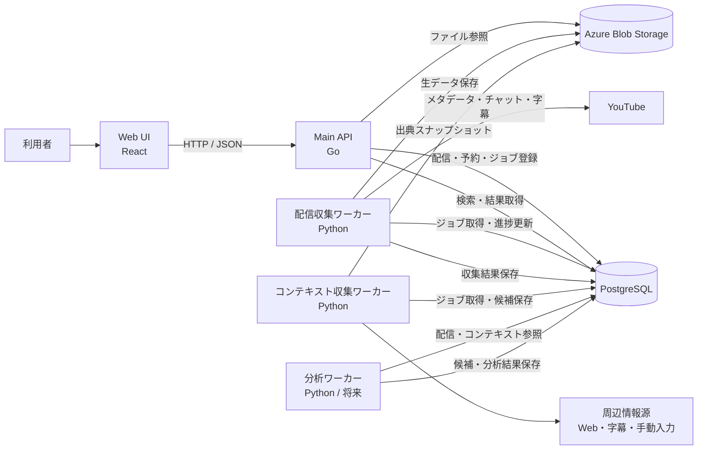
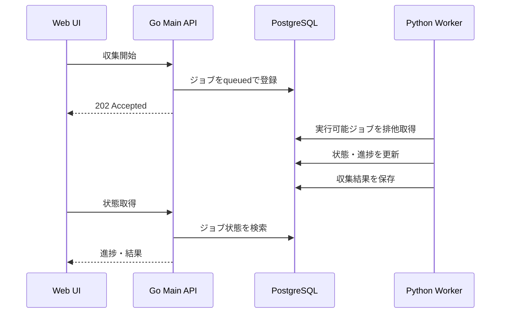

# YouTube Stream Analyzer — システム全体構成

## 1. このドキュメントの目的

YouTube Stream Analyzerを構成するシステム、各システムの責務、採用技術、データの配置、リポジトリ構成を整理する。

本ドキュメントは、個別機能の詳細設計ではなく、今後の設計・実装判断の前提となる全体構成を示す。

プロダクトの目的、フェーズ、完成条件については、[プロダクト方針とロードマップ](./product-roadmap.md)を参照する。

---

## 2. 基本方針

現時点では、次の構成を採用する。

- リポジトリは1つのモノレポとする
- Main APIはGoで実装する
- Main APIは機能単位に分割したモジュラーモノリスとする
- 時間のかかる収集・解析処理はPythonワーカーへ分離する
- ワーカーはMain APIとは別プロセス・別コンテナとして実行する
- データベースはPostgreSQLを使用する
- 配信データとコンテキストデータは論理的に分離するが、初期は同一PostgreSQL内に配置する
- 大容量ファイルと再解析可能な生データはAzure Blob Storageへ保存する
- 初期のジョブ連携にはPostgreSQLのジョブテーブルを使用する
- 必要性が明確になるまで本格的なマイクロサービス分割は行わない

この構成を、次のように表現する。

> **モノレポ + Goモジュラーモノリス + 独立Pythonワーカー**

---

## 3. システム全体像



Main APIはシステムの制御面を担当する。外部データの収集やAI処理など、長時間・高負荷・再試行を伴う処理はワーカーが担当する。

---

## 4. コンポーネントと責務

### 4.1 Web UI

利用者が配信の登録、処理状況の確認、収集結果の閲覧、切り抜き候補の確認を行う画面を提供する。

主な責務:

- YouTube配信URLの登録
- 配信情報のプレビュー
- 配信一覧とジョブ進捗の表示
- 動画、チャット、字幕の時刻同期表示
- コンテキストの閲覧・修正・承認
- 切り抜き候補の確認と状態管理

採用技術:

- React
- TypeScript
- Vite
- TanStack Query
- React Router
- React Hook Form
- Zod
- Playwright

### 4.2 Main API

Web UIに対するAPIを提供し、配信・予約・ジョブ・コンテキスト・制作情報を管理する。

主な責務:

- 配信の登録と取得
- 解析予約の登録と状態管理
- 収集ジョブの登録、停止、再実行
- ジョブ状態と進捗の取得
- 配信、チャット、字幕の検索
- コンテキストのCRUDと承認
- 配信データとコンテキストの統合
- UI向けレスポンスの生成

採用技術:

- Go
- `net/http`
- `chi`
- OpenAPI
- `oapi-codegen`
- `pgx`
- `sqlc`
- `goose`
- `log/slog`
- OpenTelemetry

Main API内の機能は、次のようなモジュールとして分割する。

```text
apps/api/internal/
├─ stream/
├─ reservation/
├─ collection/
├─ context/
├─ analysis/
├─ production/
└─ platform/
```

これらは別サービスではなく、1つのGoアプリケーション内の責務境界である。

### 4.3 配信収集ワーカー

YouTubeから配信データを取得し、正規化して保存する。

主な責務:

- 配信メタデータ取得
- ライブチャットまたはチャットリプレイ取得
- 字幕取得
- 重複排除
- 動画開始からの経過時刻への正規化
- PostgreSQLへの保存
- 生データのBlob保存
- ジョブ進捗更新
- リトライとエラー記録

採用技術:

- Python
- YouTube Data API
- yt-dlp
- HTTPX
- Pydantic
- psycopg
- FFmpeg（必要なフェーズで導入）
- Azure Storage SDK
- pytest

### 4.4 コンテキスト収集ワーカー

配信者、関係性、イベント、出来事、ミームなどの周辺情報を収集し、再利用可能なコンテキスト候補として保存する。

主な責務:

- YouTubeチャンネル・動画情報の収集
- Webページからの本文抽出
- 配信者・イベント情報の収集
- 字幕・チャットからの出来事候補抽出
- 人物、イベント、ミーム、関係性の候補抽出
- 出典と根拠の保存
- Embedding生成
- Claim候補の登録

採用技術:

- Python
- HTTPX
- Playwright
- trafilatura
- Beautiful Soup
- Pydantic
- LLM SDK
- Embedding API
- psycopg

LLMが抽出した内容は、原則として確定データへ直接登録しない。出典付きのClaim候補として保存し、必要に応じて人間が承認する。

### 4.5 分析ワーカー

配信データとコンテキストを利用し、切り抜き候補や関連区間を生成する。Phase 1の実装対象には含めず、収集・閲覧基盤の完成後に追加する。

想定する責務:

- コメント量などの時系列集計
- 注目区間の抽出
- 関連する別視点の探索
- 過去の出来事やミームとの関連付け
- 候補理由の生成
- 分析結果と候補スコアの保存

---

## 5. データストア

### 5.1 PostgreSQL

初期段階では、配信データ、ジョブ、コンテキスト、制作情報を同一PostgreSQL内で管理する。

物理的には1つのデータベースを使用し、論理的にはスキーマで責務を分離する。

```text
PostgreSQL
├─ stream
│  ├─ streams
│  ├─ chat_messages
│  ├─ transcript_segments
│  └─ stream_metrics
│
├─ collection
│  ├─ collection_jobs
│  ├─ collection_steps
│  └─ collection_artifacts
│
├─ context
│  ├─ entities
│  ├─ aliases
│  ├─ relations
│  ├─ events
│  ├─ claims
│  ├─ evidence
│  └─ source_documents
│
└─ production
   ├─ clip_candidates
   ├─ candidate_contexts
   ├─ user_markers
   └─ production_statuses
```

利用する主なPostgreSQL機能:

- リレーショナルデータ
- JSONB
- 全文検索
- `FOR UPDATE SKIP LOCKED`
- パーティショニング
- pgvector

### 5.2 コンテキストDBの考え方

コンテキストDBは、単なるベクトル化された文章置き場にはしない。

人物、関係性、イベント、出来事、ミーム、出典、根拠、有効期間を構造化して保持する。

代表的な概念:

```text
Entity
├─ Person
├─ Group
├─ Event
├─ Meme
├─ Game
└─ Organization

Relation
├─ subject
├─ predicate
├─ object
├─ valid_from
├─ valid_to
├─ confidence
└─ verification_status

Claim
├─ 抽出された事実候補
├─ 情報源
├─ 根拠箇所
└─ 承認状態
```

pgvectorは、字幕区間、出来事、ミーム、出典文章などの意味検索に使用する。構造化データの正本は通常のテーブルとして保持する。

### 5.3 Azure Blob Storage

次のような、DBへ直接保存する必要がない大容量データまたは再解析用データを保存する。

- 取得元のHTML
- APIレスポンスの生JSON
- 正規化前のチャット・字幕
- サムネイル
- 一時的な音声ファイル
- 分析生成物
- エクスポートファイル

ローカル開発ではAzuriteを使用する。

---

## 6. ジョブ実行方式

Main API内で長時間処理を実行しない。

Main APIはジョブをPostgreSQLへ登録し、ワーカーが対象ジョブを排他的に取得する。



ワーカーによるジョブ取得には、次の方式を使用する。

```sql
SELECT id
FROM collection_jobs
WHERE status = 'queued'
  AND available_at <= now()
ORDER BY priority DESC, created_at
FOR UPDATE SKIP LOCKED
LIMIT 1;
```

初期段階ではRedis、RabbitMQ、Celeryなどの外部キューを導入しない。PostgreSQLジョブ方式で不足が明確になった場合に、Azure Service Busなどへの移行を検討する。

---

## 7. 通信方式

### Web UIとMain API

- HTTP / JSON
- OpenAPIで契約を管理する
- 初期の進捗表示はポーリングでよい
- 必要になった段階でSSEを追加する

### Main APIとワーカー

初期段階では直接HTTP通信を行わない。

- Main APIはジョブをDBへ登録する
- ワーカーはDBからジョブを取得する
- ワーカーは進捗と結果をDBへ保存する

この方式により、サービス間API、認証、タイムアウト、リトライ、APIバージョニングを初期段階から持ち込まない。

---

## 8. リポジトリ構成

リポジトリはモノレポとする。

```text
youtube-stream-analyzer/
├─ apps/
│  ├─ web/                  # React Web UI
│  └─ api/                  # Go Main API
│
├─ workers/
│  ├─ stream-collector/     # 配信収集
│  ├─ context-collector/    # コンテキスト収集
│  └─ analysis-worker/      # 将来の分析処理
│
├─ database/
│  ├─ migrations/
│  ├─ queries/
│  └─ seeds/
│
├─ contracts/
│  ├─ openapi/
│  └─ schemas/
│
├─ deploy/
│  ├─ docker/
│  └─ azure/
│
├─ docs/
└─ compose.yaml
```

モノレポであっても、Web UI、Main API、各ワーカーは別々にビルド・デプロイできる構成とする。

---

## 9. 採用スタック一覧

| 領域 | 採用技術 |
|---|---|
| Web UI | React、TypeScript、Vite |
| UIデータ取得 | TanStack Query |
| UIルーティング | React Router |
| UI検証 | Zod、React Hook Form |
| Main API | Go、net/http、chi |
| API契約 | OpenAPI、oapi-codegen |
| DBアクセス | pgx、sqlc |
| DBマイグレーション | goose |
| 配信収集 | Python、YouTube Data API、yt-dlp、HTTPX |
| コンテキスト収集 | Python、Playwright、trafilatura、Beautiful Soup |
| AI処理 | LLM SDK、Embedding API |
| データベース | PostgreSQL、JSONB、全文検索、pgvector |
| ジョブ管理 | PostgreSQLジョブテーブル |
| ファイル保存 | Azure Blob Storage、Azurite |
| ログ | Go slog、Python logging |
| 可観測性 | OpenTelemetry、Azure Monitor、Application Insights |
| ローカル実行 | Docker Compose |
| UIテスト | Vitest、Testing Library、Playwright |
| API・ワーカーテスト | go test、pytest、Testcontainers |
| CI/CD | GitHub Actions |

---

## 10. 初期段階では導入しないもの

必要性が明確になるまで、次の技術や構成は導入しない。

- サービスごとの別リポジトリ
- サービスごとの別データベース
- Kubernetes
- Kafka
- RabbitMQ
- Redisを使ったジョブキュー
- Celery
- Neo4j
- OpenSearch
- サービスメッシュ
- Main API内部モジュールのマイクロサービス化

これらを恒久的に否定するものではない。運用上または性能上の具体的な課題が発生した場合に導入を判断する。

---

## 11. マイクロサービス化を検討する条件

次の条件が発生した場合は、コンポーネントのサービス分離またはリポジトリ分離を検討する。

- 担当チームが明確に分かれた
- リリース頻度やリリース責任が大きく異なる
- 特定コンポーネントだけを独立してスケールする必要がある
- データアクセス権限を物理的に分離する必要がある
- 別プロダクトから再利用されるようになった
- 独立したSLAや障害境界が必要になった
- モノレポのCI時間や依存管理が開発速度を阻害するようになった

リポジトリ分割とサービス分割は別の判断とする。モノレポのまま複数サービスを運用することも、単一サービスを複数リポジトリで管理することも可能である。

---

## 12. 設計原則

### 長時間処理をHTTPリクエスト内で完結させない

収集・文字起こし・コンテキスト抽出・分析は、必ずジョブとして実行する。

### 元データと抽出結果を分離する

外部から取得した生データを保存し、抽出ロジックやAIモデルを変更した際に再解析できるようにする。

### コンテキストには出典と時間軸を持たせる

人物関係や出来事は変化するため、根拠、有効期間、信頼度、承認状態を保持する。

### 時刻を共通軸として扱う

チャット、字幕、指標、候補区間、別視点を、動画開始からの経過時刻で接続できる構造にする。

### 外部依存を交換可能にする

YouTube取得、Web取得、LLM、Embedding、Blob Storageは、アプリケーションの中心ロジックから分離する。

---

## 13. 現時点の結論

YouTube Stream Analyzerは、次の構成から開始する。

```text
リポジトリ        モノレポ
Web UI            React / TypeScript
Main API          Goのモジュラーモノリス
長時間処理        独立したPythonワーカー
データベース      共有PostgreSQL + スキーマ分離
意味検索          pgvector
ファイル保存      Azure Blob Storage
ジョブ連携        PostgreSQLジョブテーブル
デプロイ          コンポーネント単位で分離可能
マイクロサービス  必要性が発生してから検討
```

この構成により、初期の実装・運用を過度に複雑化せず、将来のリアルタイム収集、コンテキスト収集、分析、切り抜き制作支援へ拡張できる状態を作る。
