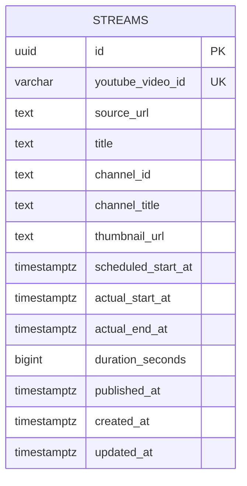

# M1 Streamデータモデル

Related issue: #13

## ER

## 配置

- PostgreSQL schema: `stream`
- Table: `stream.streams`

## 列定義

| 列 | 型 | NULL | 制約・意味 |
|---|---|---:|---|
| `id` | UUID | No | PK。`gen_random_uuid()`でDB生成 |
| `youtube_video_id` | VARCHAR(11) | No | UNIQUE。YouTube動画の自然キー |
| `source_url` | TEXT | No | 利用者が登録に使用したURL |
| `title` | TEXT | No | 登録時のタイトル |
| `channel_id` | TEXT | No | YouTubeチャンネルID |
| `channel_title` | TEXT | No | 登録時のチャンネル表示名 |
| `thumbnail_url` | TEXT | No | YouTube上のサムネイルURL |
| `scheduled_start_at` | TIMESTAMPTZ | Yes | 配信予定時刻 |
| `actual_start_at` | TIMESTAMPTZ | No | 実際の配信開始時刻 |
| `actual_end_at` | TIMESTAMPTZ | No | 実際の配信終了時刻 |
| `duration_seconds` | BIGINT | No | 動画時間。0以上 |
| `published_at` | TIMESTAMPTZ | Yes | YouTube公開時刻 |
| `created_at` | TIMESTAMPTZ | No | DB登録時刻。default `now()` |
| `updated_at` | TIMESTAMPTZ | No | 最終更新時刻。default `now()` |

## 制約

- `UNIQUE (youtube_video_id)`
- `CHECK (actual_end_at >= actual_start_at)`
- `CHECK (duration_seconds >= 0)`
- UUID生成にはPostgreSQL拡張 `pgcrypto` の `gen_random_uuid()` を使用する

## 冪等登録

`youtube_video_id` の一意制約を正本とする。

1. 新規INSERTに成功した場合は作成したStreamを返す
2. 一意制約競合時は同じ`youtube_video_id`の既存Streamを読み直して返す
3. 新規登録はHTTP 201、既存返却はHTTP 200とする

事前存在確認だけには依存せず、同時要求でもDB上は1行だけにする。

## M1で保存しないデータ

- YouTube API生レスポンス
- 動画説明全文、タグ、視聴回数等の変動値
- チャット、字幕、時系列指標
- 収集ジョブ・進捗
- サムネイルバイナリ

必要になったマイルストーンで追加マイグレーションを行う。
