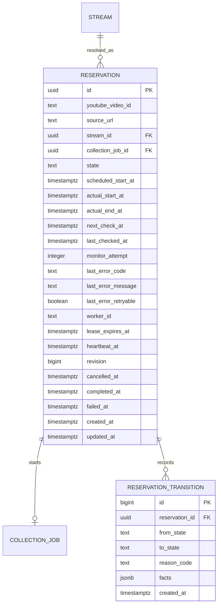

# M4 解析予約データモデル

Issue #69で確定したReservation状態機械を、後続実装がそのままmigration・repositoryへ落とせる粒度で定義する。

## ER



## `reservation.reservations`

| column | type | null | rule |
|---|---|---:|---|
| `id` | uuid | no | `gen_random_uuid()` |
| `youtube_video_id` | text | no | 11文字 |
| `source_url` | text | no | 正規化済みYouTube URL |
| `stream_id` | uuid | yes | `stream.streams(id)`、終了済みメタデータ確定後に設定 |
| `collection_job_id` | uuid | yes | `collection.collection_jobs(id)`、自動収集開始時に設定 |
| `state` | text | no | ReservationState |
| `scheduled_start_at` | timestamptz | yes | YouTube予定開始時刻 |
| `actual_start_at` | timestamptz | yes | 配信開始確認後に設定 |
| `actual_end_at` | timestamptz | yes | 配信終了確認後に設定 |
| `next_check_at` | timestamptz | no | 次回監視可能時刻 |
| `last_checked_at` | timestamptz | yes | 最後に外部状態確認を完了した時刻 |
| `monitor_attempt` | integer | no | 外部状態確認を試行した累計、初期値0 |
| `last_error_code` | text | yes | 監視・自動起動エラー |
| `last_error_message` | text | yes | 最大1000文字 |
| `last_error_retryable` | boolean | yes | 直近エラーの再試行可否 |
| `worker_id` | text | yes | 現在のlease所有者 |
| `lease_expires_at` | timestamptz | yes | claim期限 |
| `heartbeat_at` | timestamptz | yes | 最終heartbeat |
| `revision` | bigint | no | 楽観ロック、初期値0 |
| `cancelled_at` | timestamptz | yes | cancelled時のみ |
| `completed_at` | timestamptz | yes | completed時のみ |
| `failed_at` | timestamptz | yes | failed時のみ |
| `created_at` | timestamptz | no | 作成時刻 |
| `updated_at` | timestamptz | no | 更新時刻 |

### CHECK制約

```sql
state IN (
  'scheduled','monitoring','live','waiting_for_archive',
  'collecting','completed','cancelled','failed'
)
```

```sql
monitor_attempt >= 0
AND revision >= 0
```

```sql
(state <> 'collecting' OR collection_job_id IS NOT NULL)
AND (state <> 'completed' OR (collection_job_id IS NOT NULL AND completed_at IS NOT NULL))
AND (state <> 'cancelled' OR cancelled_at IS NOT NULL)
AND (state <> 'failed' OR failed_at IS NOT NULL)
```

### 一意制約・インデックス

```sql
CREATE UNIQUE INDEX reservations_active_video_uidx
ON reservation.reservations(youtube_video_id)
WHERE state NOT IN ('completed','cancelled','failed');
```

```sql
CREATE UNIQUE INDEX reservations_collection_job_uidx
ON reservation.reservations(collection_job_id)
WHERE collection_job_id IS NOT NULL;
```

```sql
CREATE INDEX reservations_due_idx
ON reservation.reservations(next_check_at, created_at, id)
WHERE state IN ('scheduled','monitoring','live','waiting_for_archive','collecting');
```

```sql
CREATE INDEX reservations_stream_idx
ON reservation.reservations(stream_id)
WHERE stream_id IS NOT NULL;
```

## `reservation.reservation_transitions`

状態変更の監査とE2E診断に使用する。通常の一覧・詳細レスポンスには全履歴を含めない。

| column | type | null | rule |
|---|---|---:|---|
| `id` | bigint | no | identity |
| `reservation_id` | uuid | no | Reservation削除時cascade |
| `from_state` | text | yes | 作成時のみnull |
| `to_state` | text | no | ReservationState |
| `reason_code` | text | no | 状態判定理由 |
| `facts` | jsonb | no | 外部判定結果の最小情報。秘密情報・レスポンス全文を保存しない |
| `created_at` | timestamptz | no | 遷移時刻 |

インデックス:

```sql
CREATE INDEX reservation_transitions_reservation_idx
ON reservation.reservation_transitions(reservation_id, created_at, id);
```

## CollectionJob拡張

`collection.collection_jobs`へnullableな`reservation_id`を追加する。

```sql
ALTER TABLE collection.collection_jobs
ADD COLUMN reservation_id uuid NULL
REFERENCES reservation.reservations(id);

CREATE UNIQUE INDEX collection_jobs_reservation_uidx
ON collection.collection_jobs(reservation_id)
WHERE reservation_id IS NOT NULL;
```

ReservationとCollectionJobの相互参照は同一トランザクション内で設定する。migrationでは、最初にReservation→CollectionJobのFKを付けずにテーブルを作成し、CollectionJobへ列追加後にReservation側FKを追加して循環参照を解決する。

## 状態別の必須・禁止フィールド

| state | stream_id | collection_job_id | next_check_at | terminal timestamp |
|---|---|---|---|---|
| scheduled | optional | null | required | null |
| monitoring | optional | null | required | null |
| live | optional | null | required | null |
| waiting_for_archive | required | null | required | null |
| collecting | required | required | required | null |
| completed | required | required | 任意の完了時刻 | completed_at |
| cancelled | optional | null | 任意の取消時刻 | cancelled_at |
| failed | optional | null | 任意の失敗時刻 | failed_at |

`collecting`では`next_check_at`を使ってCollectionJob状態を定期集約する。

## APIモデル

### CreateReservationRequest

```json
{
  "url": "https://www.youtube.com/watch?v=abcdefghijk"
}
```

### Reservation

```json
{
  "id": "uuid",
  "youtubeVideoId": "abcdefghijk",
  "sourceUrl": "https://www.youtube.com/watch?v=abcdefghijk",
  "state": "scheduled",
  "scheduledStartAt": "2026-08-03T10:00:00Z",
  "actualStartAt": null,
  "actualEndAt": null,
  "nextCheckAt": "2026-08-03T09:45:00Z",
  "lastCheckedAt": null,
  "monitorAttempt": 0,
  "lastErrorCode": null,
  "lastErrorMessage": null,
  "lastErrorRetryable": null,
  "streamId": null,
  "collectionJobId": null,
  "collectionStatus": null,
  "collectionErrorCode": null,
  "collectionErrorMessage": null,
  "canCancel": true,
  "createdAt": "2026-08-02T14:00:00Z",
  "updatedAt": "2026-08-02T14:00:00Z"
}
```

### ReservationList

`items`と`total`を返す。初版は`limit`最大100、`offset`方式とし、状態・作成日時での複雑な検索はM4対象外。

## APIエラーコード

| code | HTTP | 意味 |
|---|---:|---|
| `INVALID_RESERVATION_URL` | 400 | YouTube動画URLとして解釈不能 |
| `RESERVATION_VIDEO_NOT_FOUND` | 404 | 動画が存在しない |
| `RESERVATION_ALREADY_ACTIVE` | 409 | 同一動画の有効予約が存在する |
| `RESERVATION_NOT_FOUND` | 404 | 予約が存在しない |
| `RESERVATION_NOT_CANCELLABLE` | 409 | 現在状態ではキャンセル不能 |
| `RESERVATION_MONITORING_FAILED` | 502 | 作成時の状態取得が恒久失敗 |
| `YOUTUBE_TEMPORARILY_UNAVAILABLE` | 503 | YouTube一時障害 |

監視中に発生したエラーはHTTPエラーとして利用者へpushせず、Reservationの`lastError*`へ保存して一覧・詳細から確認可能にする。
